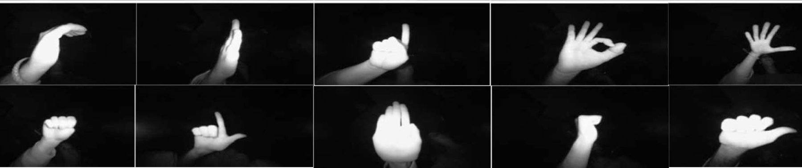

# Hand Gesture Recognition Database 
## Acquired by Leap Motion Курсовой проект «Фреймворк PyTorch для разработки искусственных нейронных сетей»

**Задание:**

Необходимо создать приложение, которое будет считывать и выводить кадры с веб-камеры. В процессе считывания должно происходить определение, что перед камерой находится человек и выполняться детекция его лица на кадре. После детекции, человек показывает жесты руками, а алгоритм классифицирует их и определенным образом реагирует на них. На то, как приложение будет реагировать на определенные жесты - выбор за Вами. Для распознавания жестов, Вам нужно скачать датасет Hand Gesture Recognition Database, создать и обучить модель. Представленная база данных распознавания жестов рук, состоящая из набора изображений в ближнем инфракрасном диапазоне, полученных датчиком Leap Motion.  

**Целевая переменная:**

Классификация жеста

**Evaluation / Метрика для оценки:**

Точность

**Описание файлов:**  
База данных состоит из 10 различных жестов рук (показанных выше), которые выполнялись 10 разными испытуемыми (5 мужчин и 5 женщин).
<li>00 (тема с идентификатором 00)</li>  
  <li>  01_palm (изображения для жеста ладонью объекта 00)</li>  
    <li>  01 ладонь / кадр 197957 r.png,…, кадр 198136_l.png,… (изображения, соответствующие различным образцам, полученным для жеста ладонью, выполненного субъектом с идентификатором 00)</li>   
  <li>  02_l (изображения для l жеста субъекта 00)</li>   
  <li>  10_down</li>   
<li>01</li>   
<li>02</li>   
<li>09 (последняя тема с идентификатором 09)</li>   
Каждая корневая папка (00, 01,…) содержит инфракрасные изображения одного объекта. Имя папки - это идентификатор каждой отдельной темы.  

**Official Website: https://www.kaggle.com/gti-upm/leapgestrecog**
